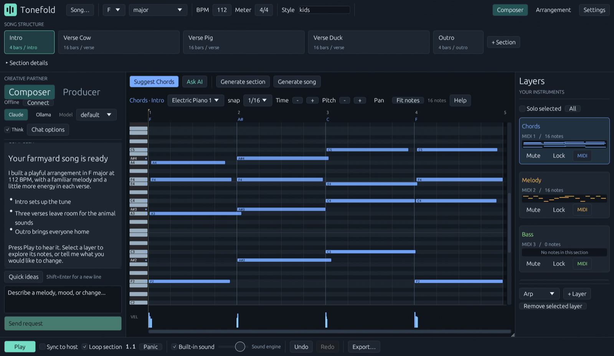

<p align="center"></p>

<h1 align="center">Tonefold</h1>

<p align="center">
  An AI music composer app. Chat with Claude, get a whole song you can edit and hear, and take it anywhere: a DAW, MIDI or WAV.
</p>

<p align="center">
  <a href="https://vkfolio.github.io/tonefold/">Website</a> ·
  <a href="https://github.com/vkfolio/tonefold/releases/latest">Download</a> ·
  <a href="docs/tutorial-twinkle.md">Tutorial</a> ·
  <a href="docs/usage.md">Docs</a>
</p>

<p align="center">
  <a href="LICENSE"></a>
  <a href="https://github.com/vkfolio/tonefold/actions/workflows/ci.yml"></a>
  <a href="https://github.com/vkfolio/tonefold/releases/latest"></a>
</p>

Tonefold is a standalone app. It writes chords, melody, bass, drums and seven more layer kinds into
a piano roll you can edit, plays them through built-in sounds, and exports MIDI, a mix and one WAV
per layer. You don't need a DAW. If you use one, an optional CLAP/VST3 plugin puts the same
composer inside it.

**Platforms:** macOS 11+ (Apple Silicon and Intel) and Windows 10+. The app is the main download;
the CLAP and VST3 plugins are optional.



## What it does

- **Composes, layer by layer.** Melody first? It fits chords to it. Chords first? It writes a melody
  over them. Bass, drums, pads, arpeggios, plucks, counter-melodies, harmonies, sub and percussion
  follow what already exists, section by section, with the whole song in view.
- **Plays like a person, not a sequencer.** Repeats are new performances rather than copies, timing
  and dynamics land where players put them, each style has its own groove and pocket, and sustained
  parts carry real expression — swells, sustain pedal, 808 glides.
- **Sounds like something immediately.** A built-in General MIDI synth means you hear the song
  before choosing a single instrument. Export the mix and one WAV per layer, or the MIDI.
- **Goes wherever you produce.** Export MIDI, a stereo mix and per-layer stems from the app, or drag
  a layer straight from Tonefold onto a track in your DAW.
- **Plans before it writes.** *Producer* mode reads the session, proposes a plan you can see — the
  key, the form, the steps and exactly which `layer@section` each one touches — and changes nothing
  until you approve it. Then it hands each step to a specialist: harmony and form, melody and
  topline, rhythm section, arrangement and mix. Nobody writes outside their own layers, and the
  whole run can be reverted in one step. *Composer* mode is still there for a quick change.
- **Edits by hand.** A full piano roll: draw, move, resize, velocity lane, drum lanes, scrub the
  playhead, click the keys to hear them. The composer sees your edits on its next turn.

## Install

Download the latest release for your system:

- **macOS:** [Tonefold-macOS.dmg](https://github.com/vkfolio/tonefold/releases/latest/download/Tonefold-macOS.dmg)
- **Windows:** [Tonefold-Windows.zip](https://github.com/vkfolio/tonefold/releases/latest/download/Tonefold-Windows.zip)

### macOS

Open the `.dmg` and drag **Tonefold** into Applications. This build is not notarized by Apple
yet, so the first time you open it macOS says it can't check the app: on macOS 15 and later go to
**System Settings → Privacy & Security** and click **Open Anyway**; on earlier versions
right-click the app, choose **Open**, then **Open** again.

Your songs, exports and logs live in `~/Library/Application Support/Tonefold`.

### Windows

Unzip the release anywhere and run:

```powershell
scripts\install.ps1
```

That installs the app under `%LOCALAPPDATA%\Tonefold` with no administrator prompt. Start
**Tonefold** from the Start Menu.

### The chat composer

**Node.js 20+** and either Claude Code signed in on your computer or an Ollama server. Everything
else, including generation, playback and export, works without them. On macOS the first chat
message installs the composer's dependencies, which takes about a minute.

## In your DAW (optional)

The same composer runs as a CLAP or VST3 plugin, follows the host's transport and can send live
MIDI to your instruments.

- **macOS:** copy `Tonefold.clap` and `Tonefold.vst3` from the `DAW plugins` folder in the `.dmg`
  to `~/Library/Audio/Plug-Ins/CLAP` and `~/Library/Audio/Plug-Ins/VST3`.
- **Windows:** run `scripts\install.ps1 -Plugins` (one UAC prompt); the plugins go to
  `C:\Program Files\Common Files\CLAP` and `VST3`.

Then rescan plugins in your DAW. **FL Studio** is the tested host; prefer the CLAP build there.
On Windows the installer also adds a piano-roll import script when FL Studio is present. Other
CLAP/VST3 hosts should work but are not yet tested; reports are welcome.

## Using it

- `docs/tutorial-twinkle.md` — a complete song, start to finish, assuming nothing (uses FL Studio for the final step).
- `docs/usage.md` — the reference: workflow, layers, arrangement, export, the humanization knobs.
- `skill/tonefold-song/SKILL.md` — compose from an external AI (Claude Code, Claude Desktop, Codex)
  through the command line.

## Building from source

Rust stable and (for the composer) Node 20+. On macOS, `scripts/package-macos.sh` builds the
universal app, the plugins and the `.dmg` in one go. On Windows:

```powershell
cargo build --release -p tonefold-plugin --features standalone --bin tonefold-standalone   # the app
cargo build --release -p tonefold-cli
cd agent; npm ci; npm run build; cd ..
cargo xtask bundle tonefold-plugin --release          # optional: the CLAP and VST3
scripts\install.ps1                                 # installs what you built (-Plugins for the CLAP/VST3)
scripts\package.ps1                                 # or make a release zip
```

Layout: `crates/tonefold-core` is the engine (theory, generators, humanization, MIDI, rendering) with
no plugin dependencies; `crates/tonefold-plugin` is the app and its egui editor, built as the
standalone app and, through nih-plug, as the optional CLAP/VST3; `crates/tonefold-cli` is the command line; `agent/` is the Claude Agent SDK sidecar (which can
also run on an Ollama model, local or remote — see `docs/usage.md`).

## Roadmap

- A notarized macOS build and an Audio Unit version of the plugin
- Testing in more DAWs: Ableton Live, Bitwig, Logic, Reaper
- Drag a layer from Tonefold straight into a DAW on macOS (Windows has it today)
- Audio-to-MIDI so the composer can follow a recorded idea
- More specialists (orchestration, sound design) and a shared style memory per project

Ideas and votes are welcome in [Discussions](https://github.com/vkfolio/tonefold/discussions).

## Contributing

Bug reports, fixes, genre knowledge and new generators are all welcome. Start with
[CONTRIBUTING.md](CONTRIBUTING.md). Security issues go through [SECURITY.md](SECURITY.md).

## Licence

GPL-3.0-or-later (see `LICENSE`) — nih-plug's VST3 bindings require it.

The composer's reference library in `agent/reference/` is based on "Music Composition Agent Skill"
by SJY051, licensed under CC BY 4.0; see `agent/reference/NOTICE.md`. The built-in sounds come from
the GeneralUser GS soundfont by S. Christian Collins, downloaded at install time under its own
licence.

Tonefold was called FLVSTX before 1.4.0.

FL Studio is a trademark of Image-Line Software. Claude is a trademark of Anthropic. Tonefold is
an independent project, not affiliated with or endorsed by either.
